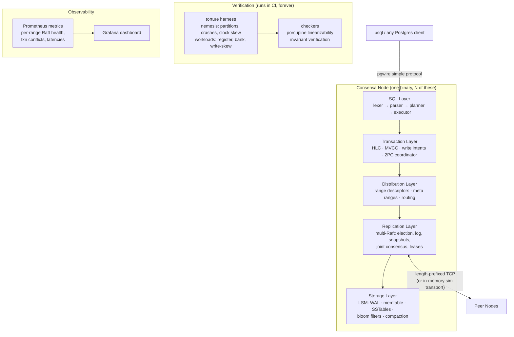

# Consensa — A Distributed SQL Database, Built From Scratch

> A CockroachDB-class distributed SQL database in Go: LSM storage, Raft consensus,
> multi-Raft range sharding, MVCC transactions with 2PC, a SQL layer speaking the
> Postgres wire protocol — and a deterministic simulation harness that **proves**
> it correct under partitions, crashes, and clock skew.

This document is the complete build plan. It is written to be followed phase by
phase, in order. Every component exists for a stated reason; everything cut is
cut for a stated reason (see [Deliberate Non-Goals](#deliberate-non-goals)).

---

## Table of Contents

- [North Star](#north-star)
- [Architecture](#architecture)
- [The Engineering Constitution](#the-engineering-constitution)
- [Repository Layout](#repository-layout)
- [Part I — The Core (Phases 0–10)](#part-i--the-core)
- [Part II — The v3 Tier (Phases 11–17)](#part-ii--the-v3-tier)
- [Deliberate Non-Goals](#deliberate-non-goals)
- [Resume Payoff Map](#resume-payoff-map)
- [Reading List](#reading-list)

---

## North Star

**One sentence:** a horizontally scalable SQL database where you can `psql` in,
run transactions across shards, kill nodes and partition the network mid-commit,
and *prove* — with a linearizability checker and invariant-verified chaos tests —
that nothing broke.

**The question this project answers better than any student project:**
*"How do you know it works?"*

Most distributed-systems side projects stop at "I ran it on three Docker
containers and it seemed fine." Consensa's answer is: every Raft safety property
and every transaction invariant is verified across thousands of seeded,
replayable fault-injection runs in CI, plus linearizability checking with
[porcupine](https://github.com/anishathalye/porcupine). Correctness is a
deliverable, not a hope.

**Success criteria, in priority order:**

1. **Correct** — verified, not assumed. A bug found by the torture harness is a
   success story, not an embarrassment; it gets a seed, a regression test, and a
   writeup.
2. **Understandable** — a strong engineer can read any package top-to-bottom in
   one sitting. Clean interfaces, no cleverness without a comment explaining the
   constraint that forced it.
3. **Honest** — limitations documented in the open (isolation level anomalies,
   clock assumptions, single-machine demo constraints). Honesty about what a
   system does *not* do is senior-engineer signal.
4. **Fast enough to measure** — benchmarks exist to show *deltas* from design
   decisions (leases vs quorum reads, vectorized vs volcano), not to chase
   RocksDB.

---

## Architecture

The target system at the end of Part I:



The layering is strict: each layer only calls the one below it. This is the
CockroachDB layering, and it is what makes a codebase of this size navigable.

---

## The Engineering Constitution

These rules are fixed for the life of the project. They exist to prevent the two
failure modes of ambitious side projects: quality rot and scope creep.

### 1. Deterministic simulation is the spine

Every component that touches the network, the clock, or the disk is written
against an interface:

```go
type Transport interface { Send(to NodeID, msg Message); Recv() <-chan Message }
type Clock     interface { Now() HLC; NewTimer(d time.Duration) Timer }
type Storage   interface { /* WAL + SSTable operations */ }
```

Production wires these to real TCP, the wall clock, and disk. Tests wire them to
an **in-memory simulated network** whose message drops, delays, duplications,
and reorderings — and whose clock skew — are driven by a **seeded PRNG**.

Consequences, and why this is the single highest-leverage decision in the plan:

- A network partition during a leader election is a **unit test**, not a Docker
  exercise. It runs in milliseconds.
- Every chaos test failure is **replayable from its seed**. "Fails under
  partition, sometimes" becomes "fails deterministically with seed 0x7C3A".
- CI can run *thousands* of randomized fault schedules per night.

This is the methodology of FoundationDB and TigerBeetle. It gets decided in
Phase 0 because it cannot be retrofitted.

### 2. The dependency allowlist

| Dependency | Purpose | Why not stdlib |
|---|---|---|
| `anishathalye/porcupine` | linearizability checking | implementing WGL from scratch is a research project, not a database |
| `prometheus/client_golang` | metrics | the ecosystem standard; hand-rolling it teaches nothing |
| `pgregory.net/rapid` | property-based testing | stdlib `testing/quick` is frozen and weaker |
| `golangci-lint` (dev only) | lint | table stakes |

**Everything else is stdlib or hand-built** — the RPC framing, the skiplist, the
SQL parser, the HLC, the Raft implementation, the pgwire encoding. Building
those *is the project*. Notably **no gRPC**: a framework transport would hide
exactly the machinery the simulator needs to control.

Adding a dependency requires an ADR explaining why building it teaches nothing.

### 3. MVCC key encoding from day one

Storage keys are `user_key ++ reverse-encoded-HLC-timestamp` starting in
Phase 1, even though transactions arrive in Phase 4. Retrofitting versioned keys
into a live LSM engine is a rewrite; encoding them early costs one design
session. (Reverse-encoded so that a forward scan finds the *newest* version of a
key first.)

### 4. Verification and observability are exit criteria, not phases

- Porcupine enters CI at Phase 2 and never leaves.
- Every phase's Definition of Done includes its Prometheus metrics.
- Phase 6 and Phase 10 *assemble and deepen* these — they don't introduce them.

### 5. Process discipline

- **CI on every push**: `go vet`, `golangci-lint`, `go test -race ./...`.
  Nightly job: torture harness across N fresh seeds.
- **One branch per phase**, merged via PR with a self-review pass against a
  checklist (naming, error handling, comment quality, test coverage of the
  failure paths — not just happy paths).
- **ADRs** (`docs/adr/NNN-title.md`) for every decision someone could reasonably
  challenge in an interview: language choice, DST architecture, no-gRPC,
  compaction strategy, isolation level, commit protocol.
- **Conventional commits**, honest messages. The git history is part of the
  portfolio.
- **Comments state constraints, not narration.** `// holding mu because compaction
  may rotate the WAL under us` — yes. `// increment the counter` — never.

---

## Repository Layout

```
consensa/
├── cmd/
│   ├── consensa/          # the node binary (server)
│   ├── consensa-cli/      # admin CLI (range inspection, membership ops)
│   └── torture/           # chaos + verification harness
├── internal/
│   ├── storage/           # Phase 1: WAL, memtable, SSTable, compaction
│   ├── raft/              # Phase 2: consensus, elections, snapshots, joint consensus
│   ├── kv/                # Phase 3: ranges, multi-raft, routing, split/merge
│   ├── txn/               # Phase 4: HLC, MVCC, intents, 2PC, (v3: SSI, parallel commits)
│   ├── sql/               # Phase 5: lexer, parser, catalog, planner, executor
│   ├── pgwire/            # Phase 5: Postgres wire protocol (simple query mode)
│   ├── sim/               # Phase 0: simulated transport, clock, fault injection
│   └── metrics/           # Prometheus registration helpers
├── docs/
│   ├── adr/               # architecture decision records
│   └── correctness.md     # Phase 6: the "how do you know it works" document
├── deploy/                # docker-compose 3-node cluster, Grafana + Prometheus
├── Makefile
└── PLAN.md                # this file
```

---

# Part I — The Core

*The v2 system: everything through observability. ~6–8 months at 15–20 hrs/wk.
Each phase ends at a demonstrable, resume-worthy checkpoint.*

---

## Phase 0 — Foundations & the Simulator Skeleton

**Effort:** ~1 week
**Purpose:** make the constitution physically real before writing feature code.
Retrofitting CI, lint, or the simulator onto a grown codebase never happens.

**Build:**

- Go module, repo layout above, `Makefile` (`build`, `test`, `lint`, `torture`).
- GitHub Actions: vet + lint + `-race` tests on push; nightly torture job
  (empty for now — the hook exists from day one).
- `internal/sim`: the `Transport`, `Clock` interfaces and their simulated
  implementations — seeded PRNG message scheduler supporting drop, delay,
  duplication, reorder; a fake clock that only advances when the test says so.
- ADR-001 (Go, and why the Python LSM gets ported rather than wrapped),
  ADR-002 (deterministic simulation architecture), ADR-003 (dependency
  allowlist).

**Definition of Done:**

- [ ] CI badge green on the repo.
- [ ] A test starts two simulated nodes, sends a message through the sim
      transport with a fixed seed, and the delivery schedule is byte-for-byte
      identical across 100 runs.
- [ ] `make torture` runs (and trivially passes) in CI nightly.

**Resume line unlocked:** none yet — this phase buys the credibility of every
later line.

---

## Phase 1 — Storage Engine (the LSM Port)

**Effort:** ~3 weeks
**Purpose:** the per-node storage engine. This is a *port* of the Python
`kv-store` engine (WAL → memtable → SSTables → compaction) to Go — the design
already exists and has 70 tests' worth of lessons baked in; the port hardens it
and gains real concurrency.

**Build:**

- **WAL**: segmented, length-prefixed, CRC-checksummed records; explicit
  `fsync` policy (`sync_every` knob); rotation after flush; idempotent replay.
- **Memtable**: hand-built **skiplist** (Go has no ordered map; a skiplist gives
  lock-friendly ordered iteration and is a classic interview structure —
  building it has purpose).
- **SSTable**: immutable, block-based format — data blocks, sparse index block,
  bloom filter block, footer. Binary search the sparse index, scan one block.
- **Compaction**: **size-tiered only**. ADR-004 records why leveled compaction
  is deferred: per-node data volume in a *sharded* database stays bounded by
  range splitting (Phase 9), so leveled's write-amplification tradeoff buys
  nothing here. (This is the anti-fluff rule in action.)
- **MVCC key encoding** (constitution §3): comparator, encoder, and iterator
  that surfaces "newest version ≤ timestamp T" — used trivially now, critically
  in Phase 4.
- Metrics: write/read/flush/compaction counters and latency histograms.

**Tests:**

- Property-based (`rapid`): random op sequences vs a model map — engine and
  model must agree after every op, across restarts.
- **Crash-recovery**: kill the process at *every* fsync boundary (injected via
  the `Storage` interface), reopen, verify no acknowledged write is lost and no
  torn write surfaces.
- Benchmarks: sequential/random write throughput, point-read latency with and
  without bloom filters. Numbers go in the README.

**Definition of Done:**

- [ ] Property suite green across 10k randomized runs.
- [ ] Kill-anywhere recovery suite green.
- [ ] Benchmark table committed (this becomes the "before" for every later perf claim).

**Resume line:** *"Built an LSM-tree storage engine in Go (WAL, skiplist
memtable, block-based SSTables with bloom filters, size-tiered compaction) with
crash-recovery tests that kill the process at every fsync boundary."*

---

## Phase 2 — Raft, From Scratch, Correctly

**Effort:** ~4–5 weeks — the make-or-break phase. Do not rush it; everything
above sits on this.
**Purpose:** consensus. Written from the paper, not ported from etcd.

**Build (in this order):**

1. **Leader election** — terms, randomized timeouts, vote safety. Plus
   **pre-vote** (Raft thesis §9.6): without it, a partitioned node rejoins with
   an inflated term and deposes a healthy leader. It's ~50 lines and prevents a
   real availability bug — purposeful, not decorative.
2. **Log replication** — AppendEntries, consistency check, commit index
   advancement, the Figure 8 commitment rule (never commit a prior term's entry
   by counting replicas — the paper's subtlest trap; there will be a test named
   `TestFigure8`).
3. **Persistence** — term/vote/log durably on the Phase 1 WAL. Crash-restart is
   a first-class sim event from the start.
4. **Snapshots** — InstallSnapshot RPC, log truncation, restore on restart.
5. **The state machine interface** — `Apply(entry) → result`, so Phase 3 can
   plug ranges in and the torture harness can plug a checkable KV in.

**Tests — this is where the project starts separating itself:**

- Sim-driven chaos: for thousands of seeds — random partitions, crash-restarts,
  message drops/reorders, clock skew — assert the paper's five safety
  properties (Election Safety, Leader Append-Only, Log Matching, Leader
  Completeness, State Machine Safety) after every step.
- **Porcupine enters CI**: a 3-node replicated register; concurrent client
  histories recorded under chaos; linearizability checked. This check never
  leaves the repo.

**Definition of Done:**

- [ ] Five safety properties hold across ≥10,000 seeded chaos runs in nightly CI.
- [ ] Porcupine verifies linearizability of the replicated KV under partitions.
- [ ] `TestFigure8` exists and fails if the commitment rule is weakened.
- [ ] Metrics: per-node term, commit index, applied index, election count,
      heartbeat round-trip histogram.

**Checkpoint — independently shippable:** "a linearizable replicated KV store,
with proof." Most student Raft projects end here, without the proof.

**Resume line:** *"Implemented Raft from the paper — elections with pre-vote,
log replication, snapshots — and verified all five safety properties plus
linearizability (porcupine) across 10,000+ seeded fault-injection schedules."*

---

## Phase 3 — Multi-Raft & Range Sharding

**Effort:** ~2–3 weeks
**Purpose:** horizontal scale. One Raft group = one range of the keyspace;
a node hosts replicas of many ranges.

**Build:**

- **Range descriptors**: `[start_key, end_key) → replica set`, stored as data
  in **meta ranges** (the addressing trick from Bigtable/CockroachDB: range
  metadata lives *in the database itself*, bootstrapped by a fixed root
  descriptor).
- **Multi-Raft multiplexing**: all ranges on a node share one transport, one
  storage engine, one Raft scheduler. **Batched heartbeats** across ranges —
  the justified optimization, because 1,000 ranges must not mean 1,000× the
  heartbeat traffic (this is *the* multi-Raft problem; naming and solving it is
  the point of the phase).
- **Routing layer**: client request → meta-range lookup (cached) → range leader;
  retry on stale descriptor (`RangeKeyMismatch`).
- Static splits only: ranges created by admin command at fixed keys. Dynamic
  arrives in Phase 9 — sharding *mechanics* and split *policy* are separate
  problems, built separately.

**Definition of Done:**

- [ ] A 3-node cluster serves a keyspace across ≥8 ranges; torture chaos on the
      register workload stays green with routing in the path.
- [ ] Descriptor cache invalidation proven by a test that moves a range and
      watches a stale client recover.
- [ ] Metrics: per-range leader, size, QPS; heartbeat batch sizes.

**Resume line:** *"Scaled Raft to multi-group: range-sharded keyspace with
self-hosted routing metadata and batched cross-range heartbeats."*

---

## Phase 4 — Distributed Transactions (MVCC + 2PC)

**Effort:** ~4–5 weeks — the intellectual core of the project.
**Purpose:** atomic, isolated transactions across ranges — the thing that makes
this a database rather than a sharded KV store.

**Design (decided now, so the build has no open questions):**
simplified CockroachDB model —

- **Hybrid Logical Clocks** for timestamps: causality-safe under bounded clock
  skew, hand-built (~150 lines), tested under sim clock skew.
- **MVCC**: reads at a snapshot timestamp see the newest version ≤ T (the
  Phase 1 key encoding pays off here — zero storage changes needed).
- **Write intents**: provisional versions carrying a pointer to their
  transaction record. Readers who encounter an intent resolve it: check the txn
  record — committed → treat as value; aborted → ignore; pending → push or wait.
- **Transaction records + 2PC**: the txn record (on the txn's first-written
  range) is the atomic commit point. Commit = one flip of that record from
  `PENDING` to `COMMITTED` (a single Raft write); intent resolution afterward is
  asynchronous cleanup. Coordinator crash mid-commit is therefore safe by
  construction — and there will be a torture scenario proving it.
- **Isolation: snapshot isolation.** Honest and explicit. SI admits
  **write skew**, and Phase 4 ships a test that *demonstrates the anomaly
  reproducibly* — checked into the repo as documentation-by-test. ADR-005
  records why SI first: it isolates the 2PC/MVCC machinery from the
  serializability machinery, which arrives as Phase 11 with its own proof. The
  anomaly test flips into a regression test that day.

**Definition of Done:**

- [ ] **Bank workload** in torture: N accounts, concurrent transfers, nemesis
      running (partitions + crash-restarts + skew); total balance invariant
      holds at every read; no transfer half-applies.
- [ ] Coordinator killed between txn-record commit and intent resolution:
      readers still converge on the committed values.
- [ ] Write-skew anomaly test: reproduces under SI (and is documented as such).
- [ ] Metrics: txn commits/aborts/restarts, intent-resolution queue depth,
      conflict rate, commit latency histogram.

**Resume line:** *"Designed and built distributed ACID transactions: MVCC over
HLC timestamps, write intents, and 2PC with single-Raft-write atomic commit —
bank-invariant verified under network partitions and coordinator crashes."*

---

## Phase 5 — The SQL Layer

**Effort:** ~3–4 weeks
**Purpose:** the user-facing proof that the layers below compose. Also the demo:
`psql` connecting to your own database is worth a thousand README words.

**Scope — fixed subset, chosen so every feature exercises the distributed layer:**

```sql
CREATE TABLE / DROP TABLE          -- catalog in system ranges
CREATE INDEX                       -- secondary indexes (see below)
INSERT / UPDATE / DELETE           -- transactional writes
SELECT ... WHERE / ORDER BY / LIMIT
SELECT ... JOIN (inner: nested-loop + hash)
EXPLAIN                            -- shows plan + index selection
BEGIN / COMMIT / ROLLBACK
```

**Build:**

- **Lexer + recursive-descent parser**, hand-written. No parser generator:
  the grammar is small, and rolling it yourself means you can answer *anything*
  about it. Pratt-style expression parsing for operator precedence.
- **Catalog**: table/index descriptors stored in system ranges (same trick as
  meta ranges — the database describes itself).
- **Row encoding**: primary key → key bytes (order-preserving encoding — worth
  building carefully; integers, strings, and composites must sort correctly as
  bytes); non-key columns → value bytes.
- **Secondary indexes — required, not optional**: index entries are separate
  keys, usually on *different ranges* than the row. This is deliberate: it makes
  every indexed write a **multi-range transaction**, which means Phase 4's 2PC
  is load-bearing in every demo, not decorative.
- **Planner — heuristic only**: predicate pushdown, index selection when a
  `WHERE` clause matches an index prefix, join algorithm choice by a trivial
  rule. Cost-based planning is Phase 14; ADR-006 says so.
- **Executor**: volcano model (`Next() (Row, error)`) — scan, filter, project,
  sort, limit, nested-loop join, hash join, insert/update/delete operators.
- **pgwire, simple query mode only** (~400 lines): startup handshake, plaintext
  password, `Query` → `RowDescription`/`DataRow`/`CommandComplete`, error
  responses. Extended protocol (prepared statements, binary formats) is a
  non-goal — simple mode is what `psql` needs.

**Definition of Done:**

- [ ] `psql -h localhost -p 5433` connects; the full subset works end-to-end on
      a 3-node cluster.
- [ ] `EXPLAIN` output shows index selection happening.
- [ ] Torture gains a **SQL bank workload** (same invariant, expressed through
      the full stack) — and it stays green under nemesis.
- [ ] Index-consistency check: after chaos, every index scan agrees
      byte-for-byte with a full-table scan.

**Resume line:** *"Built a SQL layer — hand-written parser, transactional
secondary indexes, volcano executor — speaking the Postgres wire protocol;
psql-compatible, chaos-tested through the full stack."*

---

## Phase 6 — The Torture Harness (Jepsen Methodology, Native)

**Effort:** ~2–3 weeks to assemble; permanent thereafter.
**Purpose:** consolidate the per-phase verification into one weaponized harness,
and write the document that answers *"how do you know?"* ADR-007 records why
this is a native Go harness implementing Jepsen's methodology rather than
Jepsen itself: the Clojure framework tests black-box systems over real networks
(minutes per run, non-replayable failures); the sim-native harness runs
thousands of *deterministic, seed-replayable* schedules per night. Same
methodology — generators, nemesis, checkers — strictly better ergonomics for a
system that was architected for it.

**Build — `cmd/torture`:**

- **Workloads**: `register` (linearizability via porcupine), `bank` (SI
  invariant), `index` (index/row consistency), SQL variants of each.
- **Nemesis**: partition (random bisections, asymmetric partitions, partial
  partitions), crash-restart (clean and kill -9-equivalent via the sim),
  clock skew/jumps, and — because DST makes it free — **combined schedules**
  (partition *during* leader transfer *during* restart).
- **Checkers**: porcupine adapter, invariant checkers, and a **history
  recorder** that dumps failing histories with their seed for replay.
- **CLI**: `torture run --workload bank --nemesis partition,crash --seeds 1000`,
  `torture replay --seed 0x7C3A`.
- **Nightly CI matrix** across workloads × nemeses; any failure files an issue
  with the seed.
- **`docs/correctness.md`** — the flagship document: the DST architecture, what
  is checked and what is *not* (e.g., porcupine checks the KV histories;
  SQL-level serializability is Phase 11's problem), every bug the harness has
  caught, with seeds. Interviewers read this document.

**Definition of Done:**

- [ ] Full matrix green across ≥5,000 fresh seeds.
- [ ] A deliberately injected bug (break the Figure-8 rule; drop an intent
      resolution) is caught by the harness within the nightly budget —
      *the harness itself is tested*.
- [ ] `correctness.md` committed.

**Resume line:** *"Built a deterministic-simulation chaos harness (Jepsen
methodology): seeded, replayable partition/crash/clock-skew schedules with
linearizability checking — runs 5,000+ verified fault scenarios nightly in CI."*

---

## Phase 7 — Leases & Follower Reads

**Effort:** ~2 weeks
**Purpose:** the read path, built as a correctness ladder. Each rung removes
cost; each rung's safety argument is written down.

**Build, in order:**

1. **ReadIndex** (baseline): leader confirms leadership with a heartbeat round
   before serving a read. Correct with **zero clock assumptions**. This is the
   fallback whenever leases are in doubt.
2. **Leader leases**: time-bounded leadership under a documented
   `max-clock-offset` assumption → reads with no network round-trip at all.
   ADR-008 states the assumption and its violation consequences honestly; the
   sim gets a test that violates the offset bound and demonstrates why the
   bound matters.
3. **Closed timestamps → follower reads**: leaders continuously publish
   "all writes ≤ T are final"; any replica serves reads at ≤ T. Bounded-staleness
   reads that offload the leader entirely. (This machinery is deliberately
   reused twice in Part II — changefeeds and multi-region.)

**Definition of Done:**

- [ ] Torture: linearizability holds with leases enabled, including across
      lease transfers and partitions; stale-read staleness never exceeds the
      closed-timestamp bound.
- [ ] **Benchmark table**: read p50/p99 and leader QPS for quorum-read vs
      ReadIndex vs lease vs follower read. The deltas are the deliverable.

**Resume line:** *"Implemented the read-path ladder — ReadIndex, leader leases,
closed-timestamp follower reads — with measured latency/offload wins and
sim-tested clock-assumption violations."*

---

## Phase 8 — Membership Changes (Joint Consensus)

**Effort:** ~2–3 weeks
**Purpose:** add/remove nodes on a live cluster. The part of the Raft paper
most implementations skip — which is exactly why it's here. Single-server
changes are the common shortcut; **joint consensus** (the full C_old,new
two-phase protocol) is the general, harder mechanism, and this project does
hard things with proofs.

**Build:**

- **Learner (non-voting) replicas**: new nodes catch up via snapshot before
  being promoted to voter — without this, adding a node temporarily *degrades*
  fault tolerance (a real production concern, stated in ADR-009).
- **Joint consensus**: config entries in the log; during the joint phase,
  majorities required from *both* old and new configurations; disjoint-majority
  election safety across the transition.
- Admin surface: `consensa-cli range add-replica / remove-replica / status`.
- Replica movement = add + catch up + promote + remove — **this primitive is
  what Phase 9's merge and Phase 17's placement will drive.**

**Definition of Done:**

- [ ] Torture scenario: membership change with nemesis active — leader crash
      mid-joint-phase, partition isolating the new node — safety properties and
      linearizability hold throughout.
- [ ] A node can be added to and removed from a live 3-node cluster under load
      with zero failed client requests (retries permitted, errors not).

**Resume line:** *"Implemented live membership changes via full joint consensus
with learner catch-up — chaos-verified through leader crashes mid-transition."*

---

## Phase 9 — Dynamic Range Splitting & Merging

**Effort:** ~3 weeks
**Purpose:** elasticity — the load responds to the data, not the operator.
CockroachDB's genuinely hard operational problem.

**Build — split first, merge second (the dependency is real):**

- **Split** (no replica movement needed — child ranges inherit the parent's
  nodes): triggers on size threshold *and* sustained QPS (hot-range detection
  from the Phase 3 per-range metrics); split point = size-median key, or
  hottest-key boundary for load splits. The split itself is a **transaction on
  the meta ranges** (Phase 4 machinery eating its own dog food) plus a Raft-level
  handoff of the right-hand keyspace.
- **Merge** (requires Phase 8): cold adjacent ranges → **colocate** replicas via
  replica movement → subsume the right range into the left through a
  coordinated barrier. Merge is the harder half; it ships second and its
  torture scenarios are the nastiest in the repo.

**Definition of Done:**

- [ ] Load generator hammers one key prefix → range splits automatically →
      per-range QPS rebalances — all visible in metrics.
- [ ] Cold ranges merge back automatically after load subsides.
- [ ] Torture: splits and merges racing bank-workload transactions and nemesis
      partitions; invariants hold; no keyspace gaps or overlaps ever (checked
      by a descriptor-invariant checker after every schedule).

**Resume line:** *"Built automatic range splitting/merging — load-based hot-range
detection, transactional metadata updates, replica-colocation merges —
chaos-tested against concurrent transactions."*

---

## Phase 10 — Observability Assembly & the Demo

**Effort:** ~1–2 weeks
**Purpose:** assemble the per-phase metrics into the operator experience, and
script the demo that makes the whole system legible in five minutes. Reuses the
Aegis Grafana skillset.

**Build:**

- **Grafana dashboard** (provisioned via `deploy/`): cluster overview (nodes,
  ranges, leaders), per-range Raft health (terms, elections, heartbeat
  latency), transaction panel (commits/aborts/restarts, conflict rate, intent
  queue), latency histograms (SQL p50/p99, KV, Raft commit), split/merge event
  annotations.
- **Structured logging audit**: `slog` everywhere, consistent keys
  (`range_id`, `txn_id`, `node_id`), log level discipline.
- **`docker-compose up` → 3-node cluster + Prometheus + Grafana**, one command.
- **The scripted demo** (recorded as a GIF for the README):
  1. `psql` in, create tables, run the bank workload.
  2. Watch a hot range split on the dashboard.
  3. `kill -9` a node mid-load — watch elections, zero failed invariants.
  4. Partition the leader (via a network rule) mid-2PC — watch recovery.
  5. Run the balance check. It holds. It always holds.
- **README**: architecture diagram, the demo GIF, benchmark table, links to
  `correctness.md` and the ADRs.

**Definition of Done:**

- [ ] The five-minute demo runs from a cold clone with two commands.
- [ ] README review pass: a staff engineer skimming for 90 seconds understands
      what was built and what was proven.

**Resume line:** *"Full observability: per-range Raft and transaction metrics,
Grafana dashboards, and a one-command chaos demo."*

---

**🏁 End of Part I.** At this checkpoint the original 10-item spec is complete
and verified. Everything below is the v3 tier.

---

# Part II — The v3 Tier

*What separates "best student project" from "is this a startup?". ~5–7
additional months. Selection principle: a v3 feature earns its place only if it
(a) closes a correctness gap Part I documented honestly, (b) is a signature
hard problem from a real system's papers (F1, Spanner, CockroachDB, Percolator),
or (c) deepens the proof-of-correctness story. Each phase is a clean stopping
point — ship any prefix of this list with pride.*

---

## Phase 11 — Serializable Isolation

**Effort:** ~3–4 weeks
**Purpose:** close Part I's honest gap. Phase 4 shipped snapshot isolation and
a test that *reproduces write skew*. This phase makes that test impossible to
pass — the anomaly test flips polarity and becomes a regression test. That
narrative arc (ship honestly → prove the gap → close it → prove the closure) is
the single best interview story in the project.

**Build (CockroachDB-style serializability):**

- **Read timestamp cache** per range: tracks the high-water mark of reads so a
  write below a read's timestamp gets pushed — the mechanism that breaks
  write-skew cycles.
- **Read refresh**: when a txn's write timestamp gets pushed, attempt to prove
  its read set unchanged in `(read_ts, new_ts]` and slide the read timestamp
  forward instead of aborting — the difference between "serializable" and
  "serializable but aborts constantly".
- **Uncertainty intervals**: reads within `[ts, ts + max_offset]` of another
  node's write must restart-with-bump — the HLC/clock-skew edge case, tested
  under sim skew.

**Definition of Done:**

- [ ] The Phase 4 write-skew reproduction test **now fails to reproduce** and is
      renamed into the regression suite.
- [ ] Torture gains a write-skew workload (doctor-on-call invariant: at least
      one doctor always on call) — green under full nemesis.
- [ ] Txn restart-rate metric before/after read-refresh, in the benchmark table
      (showing you measured the abort-rate cost and engineered it down).

**Resume line:** *"Upgraded the transaction layer from snapshot isolation to
serializability — timestamp cache, read refresh, uncertainty intervals — turning
the repo's own write-skew reproduction into a regression test."*

---

## Phase 12 — Parallel Commits + a TLA+ Specification

**Effort:** ~3 weeks
**Purpose:** make commits fast, and introduce formal methods with a genuine
reason. Standard 2PC costs two sequential consensus rounds; CockroachDB's
**parallel commits** protocol overlaps intent writes with a `STAGING` txn
record, committing in effectively one round. The protocol's correctness
argument is subtle enough that CockroachDB formally specified it — so this
project does too. TLA+ *because the protocol demands it* is signal; TLA+ for
decoration is fluff. ADR-010 draws exactly that line.

**Build:**

- The `STAGING` record + implicit-commit rule (a txn is committed iff staged
  and all declared intent writes succeeded), plus the recovery procedure for
  observers who find a staging record.
- **`specs/parallel_commits.tla`**: the protocol modeled in TLA+, checked with
  TLC — atomicity and durability invariants across coordinator crashes at
  every step. Model-checking config and a `specs/README.md` explaining what is
  and isn't modeled.

**Definition of Done:**

- [ ] TLC passes the invariants; a deliberately broken variant (skip the
      recovery check) fails TLC — *the spec is tested too*.
- [ ] Benchmark: multi-range commit latency before/after, in the table.
- [ ] Torture: coordinator killed at every stage of a staged commit; observers
      always converge on one outcome.

**Resume line:** *"Implemented CockroachDB's parallel-commit protocol (one-round
distributed commits) and formally specified it in TLA+, model-checking
atomicity across coordinator failures."*

---

## Phase 13 — Online Schema Changes (F1-Style)

**Effort:** ~3–4 weeks
**Purpose:** `CREATE INDEX` on a live table without blocking writes — Google's
F1 online schema-change protocol, one of the most elegant results in the
literature and almost never attempted in student projects. It ties the SQL
layer to distributed correctness: the danger is two nodes using *different
schema versions* simultaneously corrupting the index.

**Build:**

- **Versioned schema descriptors** with the F1 state machine:
  `DELETE_ONLY → WRITE_ONLY → BACKFILL → PUBLIC`, where adjacent states are
  mutually compatible — so correctness only requires nodes to be within one
  version of each other, enforced by **schema leases**.
- **Backfill** as a sequence of bounded transactions at a fixed MVCC timestamp
  (Phase 4/7 machinery), racing live writes safely because `WRITE_ONLY` writers
  are already maintaining the index.
- `DROP INDEX` runs the machine in reverse.

**Definition of Done:**

- [ ] Torture: index built on a table under sustained concurrent writes +
      nemesis; afterward, index scan agrees byte-for-byte with a full scan.
- [ ] A test demonstrating *why* the intermediate states exist: skip
      `WRITE_ONLY` in a doctored build → the harness catches the corrupted
      index. (Documentation-by-test, again.)

**Resume line:** *"Implemented F1-style online schema changes — versioned
descriptors, lease-enforced state machine, MVCC backfill — verified index
consistency under concurrent writes and chaos."*

---

## Phase 14 — Query Engine v2: Statistics, Cost, Vectorization

**Effort:** ~4–5 weeks
**Purpose:** Part I's planner is honest but naive (heuristics, row-at-a-time).
This phase is the database-internals half of the resume: a cost-based optimizer
that *demonstrably beats* the heuristic planner, and a vectorized executor
that *demonstrably beats* volcano.

**Build:**

- **Table statistics**: row counts, distinct counts, equi-depth histograms via
  reservoir sampling; collected by a background job using follower reads
  (Phase 7 reuse — stats collection shouldn't tax the leader).
- **Cost-based planning**: cardinality estimation through predicates and joins;
  costed choice of index vs full scan, join order (bounded exhaustive for ≤3
  tables — no cascades framework, ADR-011), and join algorithm.
- **Vectorized execution**: operators process typed column batches
  (~1,024 rows) instead of `Next()`-per-row — the DuckDB/modern-OLAP execution
  model. Scan, filter, projection, hash join vectorized; sort can stay
  row-based (ADR: measured, not dogma).
- **`EXPLAIN ANALYZE`**: estimated vs actual rows per operator — the honesty
  tool for the optimizer itself.

**Definition of Done:**

- [ ] A committed benchmark suite (generated skewed datasets) where the CBO
      picks different — and measurably faster — plans than the heuristic
      planner, with `EXPLAIN` diffs in the docs.
- [ ] Vectorized vs volcano microbenchmarks: scan/filter/join throughput deltas
      in the table.
- [ ] Estimated-vs-actual cardinality error tracked as a metric.

**Resume line:** *"Built a cost-based query optimizer (histogram statistics,
cardinality estimation, join ordering) and a vectorized execution engine —
benchmarked wins over the v1 heuristic planner and volcano executor."*

---

## Phase 15 — Changefeeds (CDC)

**Effort:** ~2–3 weeks
**Purpose:** every serious database exports its changes. Changefeeds are the
purposeful reuse test of the whole architecture: Raft log → per-range feeds,
closed timestamps → resolved timestamps. If the earlier layers were designed
right, this phase is *small* — that smallness is itself the proof.

**Build:**

- **Rangefeeds**: per-range subscription to committed MVCC writes, tailing the
  Raft apply loop; catch-up scans from a start timestamp for late subscribers.
- **Resolved timestamps**: closed-timestamp-driven watermarks — "you have seen
  everything ≤ T" — emitted into the stream (Aegis watermark experience
  transfers directly here).
- **Changefeed job**: table-level, fans in rangefeeds, survives range
  splits/merges (Phase 9 interaction — the interesting bug surface),
  at-least-once ordered-per-key delivery to a sink (newline-JSON file /
  webhook; Kafka is a non-goal).

**Definition of Done:**

- [ ] Torture: a consumer reconstructs table state purely from the changefeed
      and diffs clean against the source — while nemesis, splits, and merges
      run.
- [ ] Resolved timestamps never regress and never overrun an unresolved write
      (checker-enforced).

**Resume line:** *"Built CDC changefeeds on the Raft log with
closed-timestamp-derived resolved watermarks — consumer-reconstruction verified
under chaos, splits, and merges."*

---

## Phase 16 — Backup, Restore & Point-in-Time Recovery

**Effort:** ~2 weeks
**Purpose:** the operational-maturity feature. MVCC makes it elegant: a backup
is a consistent scan *as of* a timestamp; an incremental backup is "every
version in `(T1, T2]`"; PITR is restore-to-T. Small phase, high leverage —
and it's the feature interviewers' teams actually get paged about.

**Build:**

- `BACKUP TABLE ... TO <dir> [INCREMENTAL FROM <prev>]` — consistent
  MVCC-timestamped export (follower reads again — backups don't tax leaders),
  manifest with span/time metadata and checksums.
- `RESTORE TABLE ... FROM <chain> [AS OF <ts>]` — ingest base + increments,
  reconstruct state at exactly T.

**Definition of Done:**

- [ ] Torture: bank workload runs; full backup at T1, incrementals at T2, T3;
      writes continue; restore to T2 → invariant holds *at exactly T2's state*.
- [ ] Corrupted-manifest and mid-restore-crash tests: restore is atomic —
      fully applied or absent.

**Resume line:** *"Implemented incremental backup and point-in-time recovery on
MVCC timestamps — restore-to-timestamp verified against a live invariant
workload."*

---

## Phase 17 — Multi-Region (Capstone)

**Effort:** ~3–4 weeks
**Purpose:** the Spanner problem — the capstone that composes *everything*:
placement drives Phase 8's replica movement, latency-aware reads ride Phase 7's
follower reads, and the whole thing is honestly demoable on one laptop because
the simulator injects realistic inter-region latency (ADR-012 documents the
single-machine constraint plainly — honesty rule).

**Build:**

- **Localities**: nodes declare `region/zone`; placement rules
  (`ALTER TABLE ... CONFIGURE ZONE`) constrain replica placement; a placement
  reconciler drives Phase 8 replica movement until constraints hold.
- **Follow-the-workload leases**: lease placement migrates toward the region
  generating the most traffic (hysteresis, not oscillation — the metric exists
  from Phase 3).
- **Bounded-staleness global reads**: any region serves reads within the
  closed-timestamp bound, no cross-region hop.
- Sim latency matrix (e.g., us-east ↔ eu-west 80ms) as a first-class nemesis
  dimension.

**Definition of Done:**

- [ ] Demo + dashboard: workload moves from region A to region B → leases
      follow → p99 write latency in B drops from cross-region to local, on the
      graph.
- [ ] Torture with a full region partitioned away: majority side stays
      available, invariants hold, isolated region serves only
      bounded-staleness reads.

**Resume line:** *"Built multi-region support — locality-constrained placement,
follow-the-workload lease migration, bounded-staleness global reads — verified
under region-scale partitions."*

---

## Deliberate Non-Goals

Cut because they teach no new distributed-systems concept, weaken focus, or
duplicate a lesson already learned elsewhere in the project. This list is part
of the engineering, not an apology.

| Cut | Why |
|---|---|
| **Jepsen (the Clojure framework)** | Its *methodology* is implemented natively in the DST harness — deterministic and replayable, which black-box Jepsen is not. A choice, not ignorance (ADR-007). |
| **gRPC / etcd-raft / any consensus library** | The transport and consensus *are* the project; frameworks would hide exactly what must be controlled and learned. |
| **Leveled compaction** | Range splitting bounds per-node data; size-tiered suffices at this scale. Revisit only if storage benchmarks say so (ADR-004). |
| **Cascades-style optimizer framework** | Phase 14's bounded exhaustive join ordering teaches costing; a transformation-rule engine is optimizer-industry plumbing. |
| **Outer joins, subqueries, CTEs, views** | More parser/executor surface, zero new distributed insight. The subset already exercises every layer. |
| **pgwire extended protocol** | Simple query mode is all `psql` needs for the demo; prepared-statement plumbing is protocol trivia. |
| **HTAP / columnar storage engine** | A second storage engine doubles surface area; Phase 14's vectorized executor already teaches the columnar execution lesson. |
| **Kafka sink for CDC** | File/webhook sinks prove the hard parts (ordering, resolved timestamps); Kafka integration is configuration. |
| **Kubernetes operator** | Ops packaging, not systems engineering. `docker-compose` demos everything. |
| **Admission control / rate limiting** | Real, but already demonstrated in `go-auth-service`; duplicating it here adds nothing new. |
| **WASM UDFs, GPU anything, io_uring, custom allocators** | Complexity for spectacle — the exact thing this plan exists to prevent. |
| **Geo-partitioned rows (row-level homing)** | Phase 17's table-level placement teaches the placement lesson; row-level homing is a large multiplier on it for the same insight. |

---

## Resume Payoff Map

Independently shippable checkpoints — the project is *never* "half-built with
nothing to show":

| Checkpoint | You can already claim |
|---|---|
| End of Phase 2 | Raft from scratch, linearizability-verified under 10k+ fault schedules |
| End of Phase 6 | Distributed SQL database with a Jepsen-style correctness harness |
| End of Phase 10 | **The complete v2 spec — flagship-project grade** |
| End of Phase 12 | + serializability and a model-checked commit protocol (TLA+) |
| End of Phase 17 | A system whose feature list reads like a database company's |

Interview ammunition by phase (the questions you'll *want* to be asked):

- **P2**: "How does Raft prevent split-brain?" — you've watched it not split
  across 10,000 adversarial schedules, and you can name the Figure-8 trap.
- **P4/P11**: "Difference between snapshot isolation and serializability?" —
  you have a write-skew reproduction *and* the commit that killed it.
- **P6**: "How do you test distributed systems?" — deterministic simulation,
  seeds, replayability; you can critique Jepsen's tradeoffs from experience.
- **P7**: "How do reads scale in Raft systems?" — you benchmarked all four
  rungs of the ladder.
- **P12**: "Ever used formal methods?" — for a protocol that genuinely needed
  it, and your spec catches a seeded protocol bug.
- **P13**: "How do you change schemas without downtime?" — you implemented the
  F1 paper and can explain *why* the intermediate states must exist.

**Honest totals** at 15–20 hrs/week: Part I ≈ 6–8 months, Part II ≈ 5–7 months.
This is a 12–15 month flagship. The checkpoint table is the pacing tool — climb
the tiers; any stopping point above Phase 6 is already a top-of-resume project.

---

## Reading List

Read the starred item *before* starting its phase; the rest during.

| Phase | Read |
|---|---|
| 1 | ★ *The Log-Structured Merge-Tree* (O'Neil); RocksDB wiki: BlockBasedTable format |
| 2 | ★ *In Search of an Understandable Consensus Algorithm* (extended Raft paper — read it three times); Ongaro's thesis ch. 3–4 |
| 3 | CockroachDB architecture docs: Distribution Layer; Bigtable paper §5 (tablet location) |
| 4 | ★ *Large-scale Incremental Processing* (Percolator); CockroachDB blog: "How CockroachDB Does Distributed, Atomic Transactions"; *Logical Physical Clocks* (HLC paper) |
| 5 | *Architecture of a Database System* (Hellerstein et al.) §4; Postgres protocol docs (message flow, simple query) |
| 6 | ★ Jepsen analyses (read 2–3, e.g. etcd, CockroachDB); TigerBeetle: "Deterministic Simulation Testing"; porcupine README |
| 7 | Raft thesis §6.4 (ReadIndex, leases); CockroachDB blog: closed timestamps |
| 8 | ★ Raft thesis ch. 4 (membership; read the joint-consensus safety argument twice) |
| 9 | CockroachDB blog: range merges; design doc: load-based splitting |
| 11 | ★ *A Critique of ANSI SQL Isolation Levels* (Berenson et al.); CockroachDB blog: serializable, lockless, distributed |
| 12 | ★ CockroachDB blog: Parallel Commits (+ their TLA+ spec); *Practical TLA+* (Wayne) ch. 1–6 |
| 13 | ★ *Online, Asynchronous Schema Change in F1* (read until the state-compatibility argument is obvious) |
| 14 | *Access Path Selection* (Selinger — the CBO paper); *MonetDB/X100: Hyper-Pipelining Query Execution* (vectorization) |
| 15 | CockroachDB docs: changefeed architecture, rangefeeds |
| 16 | CockroachDB docs: backup architecture (MVCC export) |
| 17 | ★ *Spanner: Google's Globally-Distributed Database* §2–4 |

---

*Plan version 1.0 — the constitution is fixed; phase internals may be refined
via ADRs as the build teaches its lessons.*
